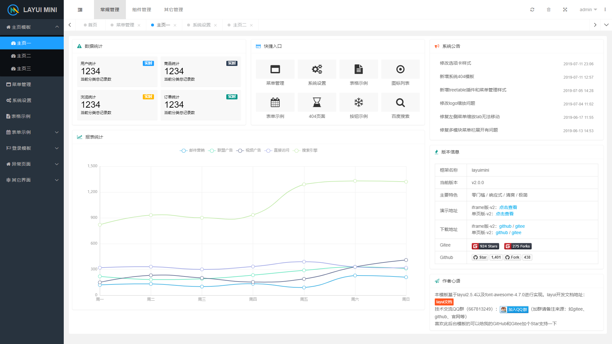

layuimini后台模板
===============
# 项目介绍
最简洁、清爽、易用的layui后台框架模板。

项目会不定时进行更新，建议star和watch一份。

技术交流QQ群：[667813249](https://jq.qq.com/?_wv=1027&k=5lyiE2Q)、[561838086🈵](https://jq.qq.com/?_wv=1027&k=5JRGVfe) `加群请备注来源：如gitee、github、官网等`。

# 主要特性
* 界面足够简洁清爽，响应式且适配手机端。
* 一个接口`几行代码而已`直接初始化整个框架，无需复杂操作。
* 页面支持多配色方案，可自行选择喜欢的配色。
* 支持多tab，可以打开多窗口。
* 支持无限级菜单和对font-awesome图标库的完美支持。
* 失效以及报错菜单无法直接打开，并给出弹出层提示`完美的线上用户体验`。
* url地址hash定位，可以清楚看到当前tab的地址信息。
* 刷新页面会保留当前的窗口，并且会定位当前窗口对应左侧菜单栏。
* 支持font-awesome图标选择插件

# 代码仓库(iframe 多tab版)

### v2版
 * 在线预览地址：[http://layuimini.99php.cn/iframe/v2/index.html](http://layuimini.99php.cn/iframe/v2/index.html)
 * GitHub仓库地址：[https://github.com/zhongshaofa/layuimini/tree/v2](https://github.com/zhongshaofa/layuimini/tree/v2)
 * Gitee仓库地址：[https://gitee.com/zhongshaofa/layuimini/tree/v2](https://gitee.com/zhongshaofa/layuimini/tree/v2)
### v1版
  * 在线预览地址：[http://layuimini.99php.cn/iframe/v1/index.html](http://layuimini.99php.cn/iframe/v1/index.html)
  * GitHub仓库地址：[https://github.com/zhongshaofa/layuimini/tree/master](https://github.com/zhongshaofa/layuimini/tree/master)
  * Gitee仓库地址：[https://gitee.com/zhongshaofa/layuimini/tree/master](https://gitee.com/zhongshaofa/layuimini/tree/master)
 
# 代码仓库(onepage 单页版)

### v2版
 * 在线预览地址：[http://layuimini.99php.cn/onepage/v2/index.html](http://layuimini.99php.cn/onepage/v2/index.html)
 * GitHub仓库地址：[https://github.com/zhongshaofa/layuimini/tree/v2-onepage](https://github.com/zhongshaofa/layuimini/tree/v2-onepage)
 * Gitee仓库地址：[https://gitee.com/zhongshaofa/layuimini/tree/v2-onepage](https://gitee.com/zhongshaofa/layuimini/tree/v2-onepage)
 
### v1版
 * 在线预览地址：[http://layuimini.99php.cn/onepage/v1/index.html](http://layuimini.99php.cn/onepage/v1/index.html)
 * GitHub仓库地址：[https://github.com/zhongshaofa/layuimini/tree/onepage](https://github.com/zhongshaofa/layuimini/tree/onepage)
 * Gitee仓库地址：[https://gitee.com/zhongshaofa/layuimini/tree/onepage](https://gitee.com/zhongshaofa/layuimini/tree/onepage)

# 下载方式

### iframe v2版
 * GitHub下载命令：`git clone https://github.com/zhongshaofa/layuimini -b v2`
 * Gitee下载命令：`git clone https://gitee.com/zhongshaofa/layuimini -b v2`
### iframe v1版
 * GitHub下载命令：`git clone https://github.com/zhongshaofa/layuimini -b master`
 * Gitee下载命令：`git clone https://gitee.com/zhongshaofa/layuimini -b master`
### 单页版 v2版
 * GitHub下载命令：`git clone https://github.com/zhongshaofa/layuimini -b v2-onepage`
 * Gitee下载命令：`git clone https://gitee.com/zhongshaofa/layuimini -b v2-onepage`
### 单页版 v1版
 * GitHub下载命令：`git clone https://github.com/zhongshaofa/layuimini -b onepage`
 * Gitee下载命令：`git clone https://gitee.com/zhongshaofa/layuimini -b onepage`
### 发行版地址
* GitHub发版地址：[https://github.com/zhongshaofa/layuimini/releases](https://github.com/zhongshaofa/layuimini/releases)
* Gitee发版地址：[https://gitee.com/zhongshaofa/layuimini/releases](https://gitee.com/zhongshaofa/layuimini/releases)
 
# 效果预览
> 总体预览

# 使用说明

文档地址：[查看文档](http://layuimini.99php.cn/docs/)

 # 捐赠支持
 
开源项目不易，若此项目能得到你的青睐，可以捐赠支持作者持续开发与维护，感谢所有支持开源的朋友。

 
